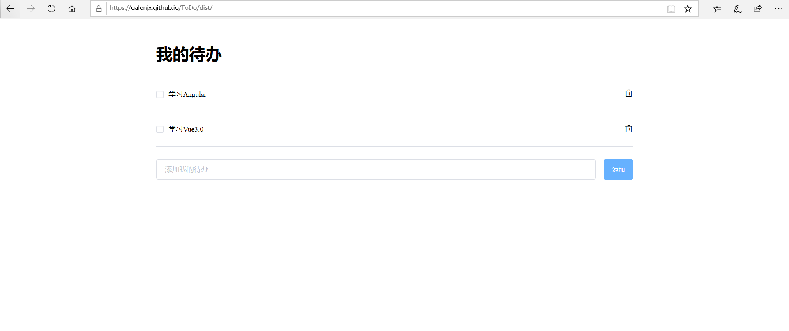

### ToDo

这是一个用Vue与element-ui搭建的简易备忘录，运用了element-ui的 Input, Divider, Checkbox, MessageBox,Message ,Button等组件，布局简洁，提示信息友好，同时利用@media实现响应式布局，适配pc与移动端，待办数据使用localStorage持久化存储。

### 使用

1. 在下载好的目录：

```shell
cnpm i
npm run dev
```

2. 或者直接以文件形式打开 ：双击运行下载好的dist/index.html文件，

### 预览
#### 移动端


#### pc端

